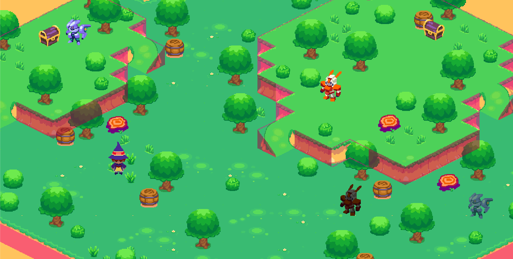

# Elements Isometric

> Concept of an isometric game revolving around the use of elements

---
This repository includes: 
- enemies pathfinding and movement
- player movement
- weapon selection and firing
- enemies interaction with projectile

The interactions between enemies and projectiles are as follow:
- Fire enemy can be lured by fire projectiles, staggered by air projectiles and killed by water projectiles
- Water enemy can be killed by air projectile, killed by water projectiles and will splash water projectiles on death
- Earth enemy can be killed by earth projectile, lit on fire by fire projectiles (which will stagger it) and extinguish by water projectiles
- Air enemy can be slowed and then killed by air projectiles

The goal of this repository is to show an idea of gameplay and an efficient code for multiple enemies’ behaviour